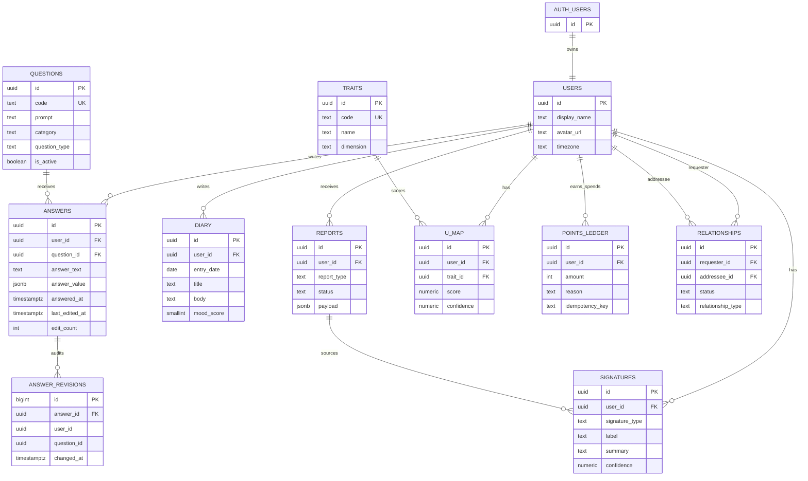

# FI-YOU Supabase Database Design

## Scope

This design targets Supabase PostgreSQL with Row Level Security enabled on every exposed `public` table.

Core entities:

- `users`
- `questions`
- `answers`
- `diary`
- `signatures`
- `traits`
- `u_map`
- `points_ledger`
- `reports`
- `relationships`

Hard rules:

- Point balance is never stored. It is derived from `points_ledger`.
- Answer creation time and edit history are recorded.
- Answer timing and edit audit data are not exposed to normal users.
- Users can read and mutate only their own private data through RLS.

## Schema

### `public.users`

Application profile row mapped one-to-one to `auth.users`.

Key columns:

- `id uuid primary key references auth.users(id)`
- `display_name text`
- `avatar_url text`
- `timezone text`
- `created_at timestamptz`
- `updated_at timestamptz`

Access:

- User can select, insert, and update only their own row.

### `public.questions`

Question catalog. Questions are shared content, not user-owned.

Key columns:

- `id uuid primary key`
- `code text unique`
- `prompt text`
- `category text`
- `question_type text`
- `answer_schema jsonb`
- `is_active boolean`
- `sort_order int`
- `created_at timestamptz`

Access:

- Authenticated users can read active questions.
- Writes should be service-role/admin only.

### `public.answers`

Current answer state per user and question.

Key columns:

- `id uuid primary key`
- `user_id uuid references public.users(id)`
- `question_id uuid references public.questions(id)`
- `answer_text text`
- `answer_value jsonb`
- `answered_at timestamptz`
- `last_edited_at timestamptz`
- `edit_count int`
- `created_at timestamptz`
- `updated_at timestamptz`

Constraints:

- `unique (user_id, question_id)`
- Either `answer_text` or `answer_value` must be present.

Visibility:

- Normal users can access their own answer content.
- Normal users are not granted `SELECT` on `answered_at`, `last_edited_at`, `edit_count`, `created_at`, or `updated_at`.
- All edits are copied into `private.answer_revisions`.

### `private.answer_revisions`

Audit table for answer modifications.

Key columns:

- `id bigint generated always as identity`
- `answer_id uuid`
- `user_id uuid`
- `question_id uuid`
- `old_answer_text text`
- `new_answer_text text`
- `old_answer_value jsonb`
- `new_answer_value jsonb`
- `changed_at timestamptz`
- `changed_by uuid`

Access:

- No direct `anon` or `authenticated` grants.
- Service-role/backend only.

### `public.diary`

Private user diary entries.

Key columns:

- `id uuid primary key`
- `user_id uuid references public.users(id)`
- `entry_date date`
- `title text`
- `body text`
- `mood_score smallint`
- `tags text[]`
- `created_at timestamptz`
- `updated_at timestamptz`

Access:

- User can select, insert, update, and delete only their own diary rows.

### `public.signatures`

User-owned identity/signature snapshots generated from answers, diary, or reports.

Key columns:

- `id uuid primary key`
- `user_id uuid references public.users(id)`
- `signature_type text`
- `label text`
- `summary text`
- `confidence numeric(5,4)`
- `source_report_id uuid references public.reports(id)`
- `metadata jsonb`
- `created_at timestamptz`
- `updated_at timestamptz`

Access:

- User can read own signatures.
- Inserts/updates can be allowed to the user if generated client-side, but the recommended production path is backend/service-role generation.

### `public.traits`

Trait catalog used by `u_map`.

Key columns:

- `id uuid primary key`
- `code text unique`
- `name text`
- `description text`
- `dimension text`
- `is_active boolean`
- `created_at timestamptz`

Access:

- Authenticated users can read active traits.
- Writes should be service-role/admin only.

### `public.u_map`

Per-user trait map.

Key columns:

- `id uuid primary key`
- `user_id uuid references public.users(id)`
- `trait_id uuid references public.traits(id)`
- `score numeric(6,3)`
- `confidence numeric(5,4)`
- `evidence_count int`
- `source text`
- `metadata jsonb`
- `calculated_at timestamptz`

Constraints:

- `unique (user_id, trait_id)`

Access:

- User can read own map.
- Writes should be backend/service-role in production.

### `public.points_ledger`

Append-only point transactions. This is the only source of truth for point totals.

Key columns:

- `id uuid primary key`
- `user_id uuid references public.users(id)`
- `amount integer`
- `reason text`
- `reference_type text`
- `reference_id uuid`
- `idempotency_key text`
- `metadata jsonb`
- `created_at timestamptz`

Constraints:

- `amount <> 0`
- `unique (user_id, idempotency_key)` when `idempotency_key is not null`

Access:

- User can read own ledger rows.
- Normal users cannot insert, update, or delete ledger rows.
- Points are awarded by trusted backend/service-role only.

Balance query:

```sql
select coalesce(sum(amount), 0) as points
from public.points_ledger
where user_id = auth.uid();
```

### `public.reports`

Generated reports for a user.

Key columns:

- `id uuid primary key`
- `user_id uuid references public.users(id)`
- `report_type text`
- `status text`
- `title text`
- `summary text`
- `payload jsonb`
- `generated_at timestamptz`
- `created_at timestamptz`
- `updated_at timestamptz`

Access:

- User can read own reports.
- Writes should be backend/service-role.

### `public.relationships`

Connections between two users.

Key columns:

- `id uuid primary key`
- `requester_id uuid references public.users(id)`
- `addressee_id uuid references public.users(id)`
- `status text`
- `relationship_type text`
- `created_at timestamptz`
- `accepted_at timestamptz`
- `updated_at timestamptz`

Constraints:

- `requester_id <> addressee_id`
- Only one relationship per unordered user pair.

Access:

- User can read relationships where they are requester or addressee.
- User can create a pending relationship as requester.
- User can update rows involving them, with stricter app-level validation recommended for state transitions.

## ERD



## RLS Model

Principles:

- Enable RLS on every `public` table.
- User-owned rows use `(select auth.uid()) = user_id`.
- Relationship rows use `(select auth.uid()) in (requester_id, addressee_id)`.
- Catalog tables expose active records only.
- Ledger writes and report/signature/u-map generation are trusted backend operations.
- Answer audit data is stored in `private.answer_revisions`, outside the exposed schema.

Column-level exposure for `answers`:

- Grant normal users `SELECT` only on `id`, `user_id`, `question_id`, `answer_text`, and `answer_value`.
- Do not grant normal users `SELECT` on answer timing and edit metadata columns.

## API Design

The API can be implemented with Supabase client queries plus server-only endpoints for trusted mutations.

### Auth/Profile

- `GET /me`
  - Reads `public.users` where `id = auth.uid()`.
- `PATCH /me`
  - Updates display profile fields only.

### Questions

- `GET /questions`
  - Returns active question catalog ordered by `sort_order`.

### Answers

- `GET /answers`
  - Returns current user's answer content only.
  - Hidden DB fields: `answered_at`, `last_edited_at`, `edit_count`, `created_at`, `updated_at`.
- `PUT /answers/:questionId`
  - Upserts current user's answer.
  - DB trigger records insert/update timing and creates audit revisions on edits.

### Diary

- `GET /diary?from=&to=`
  - Returns current user's entries.
- `POST /diary`
  - Creates current user's entry.
- `PATCH /diary/:id`
  - Updates current user's entry.
- `DELETE /diary/:id`
  - Deletes current user's entry.

### Signatures

- `GET /signatures`
  - Returns current user's signatures.
- `POST /internal/signatures/recalculate`
  - Server-only. Uses service role. Regenerates signatures from source data.

### Traits and U-Map

- `GET /traits`
  - Returns active trait catalog.
- `GET /u-map`
  - Returns current user's trait scores.
- `POST /internal/u-map/recalculate`
  - Server-only. Uses service role.

### Points

- `GET /points`
  - Returns `sum(points_ledger.amount)` for current user.
- `GET /points/ledger`
  - Returns current user's ledger rows.
- `POST /internal/points`
  - Server-only. Appends a ledger row with an idempotency key.

### Reports

- `GET /reports`
  - Returns current user's reports.
- `GET /reports/:id`
  - Returns one current-user report.
- `POST /internal/reports/generate`
  - Server-only. Uses service role.

### Relationships

- `GET /relationships`
  - Returns rows involving current user.
- `POST /relationships`
  - Creates a pending relationship request from current user.
- `PATCH /relationships/:id`
  - Updates relationship status for rows involving current user.

