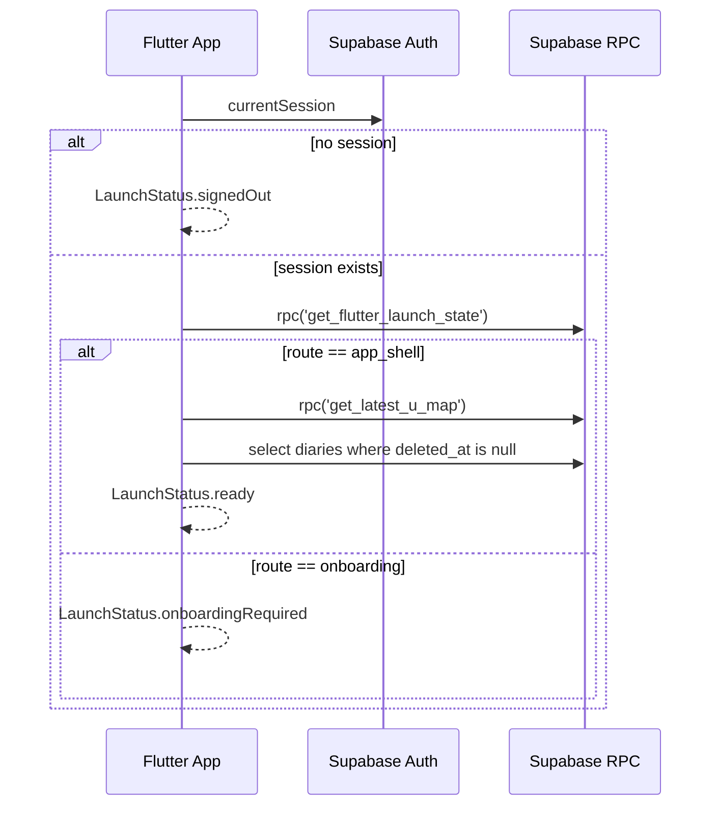

# Flutter Supabase Repository Mapping

Status: P0 handoff for replacing `SupabaseFiYouRepository extends MockFiYouRepository`.

## Release launch rule

Flutter owns the no-session branch. Supabase owns the authenticated profile branch.

| State | Flutter route |
| --- | --- |
| `client.auth.currentSession == null` | Auth |
| session exists + `get_flutter_launch_state.route == 'onboarding'` | Onboarding |
| session exists + `get_flutter_launch_state.route == 'app_shell'` | App shell |

Do not use `user.userMetadata['onboarding_complete']` for this gate. `user_metadata` is user-editable and is not the FI-YOU release source of truth.

## Restore sequence



## Minimal Dart types

```dart
enum LiveLaunchRoute { auth, onboarding, appShell }

class FlutterLaunchState {
  const FlutterLaunchState({
    required this.route,
    required this.profileExists,
    required this.onboardingCompleted,
    required this.starBalance,
    this.profile,
    this.latestUMapSnapshotId,
  });

  final LiveLaunchRoute route;
  final bool profileExists;
  final bool onboardingCompleted;
  final int starBalance;
  final Map<String, dynamic>? profile;
  final String? latestUMapSnapshotId;

  factory FlutterLaunchState.fromJson(Map<String, dynamic> json) {
    return FlutterLaunchState(
      route: json['route'] == 'app_shell'
          ? LiveLaunchRoute.appShell
          : LiveLaunchRoute.onboarding,
      profileExists: json['profileExists'] == true,
      onboardingCompleted: json['onboardingCompleted'] == true,
      starBalance: (json['starBalance'] as num?)?.toInt() ?? 0,
      profile: json['profile'] as Map<String, dynamic>?,
      latestUMapSnapshotId: json['latestUMapSnapshotId'] as String?,
    );
  }
}

class QuestionAnswerInput {
  const QuestionAnswerInput({
    required this.questionSet,
    required this.questionId,
    this.selectedOptionId,
    this.optionalText,
    this.skipped = false,
  });

  final String questionSet; // onboarding_required or basic_free
  final String questionId;
  final String? selectedOptionId;
  final String? optionalText;
  final bool skipped;
}
```

## Repository pseudo-code

```dart
class SupabaseFiYouRepository extends FiYouRepository {
  SupabaseFiYouRepository(this.client);

  final SupabaseClient client;

  @override
  Future<LaunchSnapshot> restoreLaunchState() async {
    final session = client.auth.currentSession;
    if (session == null) {
      return const LaunchSnapshot(status: LaunchStatus.signedOut);
    }

    final data = await client.rpc('get_flutter_launch_state');
    final state = FlutterLaunchState.fromJson(Map<String, dynamic>.from(data));

    if (state.route == LiveLaunchRoute.onboarding) {
      return const LaunchSnapshot(status: LaunchStatus.onboardingRequired);
    }

    await _hydrateHomeData(state);
    return const LaunchSnapshot(status: LaunchStatus.ready);
  }

  Future<void> signInWithGoogle() async {
    await client.auth.signInWithOAuth(OAuthProvider.google);
  }

  @override
  Future<void> completeOnboarding({required String name}) async {
    final data = await client.rpc('complete_onboarding', params: {
      'p_nickname': name,
      'p_preferred_language': 'ko',
      'p_focus_area': null,
    });
    final state = FlutterLaunchState.fromJson(
      Map<String, dynamic>.from(data['flutterLaunchState'] as Map),
    );
    await _hydrateHomeData(state);
    notifyListeners();
  }

  Future<Map<String, dynamic>> submitQuestionAnswer(
    QuestionAnswerInput input,
  ) {
    return client.rpc('submit_question_answer', params: {
      'p_question_set': input.questionSet,
      'p_question_id': input.questionId,
      'p_selected_option_id': input.selectedOptionId,
      'p_optional_text': input.optionalText,
      'p_skipped': input.skipped,
    }).then((data) => Map<String, dynamic>.from(data as Map));
  }
}
```

## Method mapping

| Existing `FiYouRepository` method | Live implementation |
| --- | --- |
| `restoreLaunchState()` | session check, then `rpc('get_flutter_launch_state')` |
| `signInWithMockAccount()` | Do not ship. Replace with `signInWithGoogle()` or approved release auth method |
| `completeOnboarding(name)` | `rpc('complete_onboarding', { p_nickname: name, p_preferred_language: 'ko' })` |
| `signOut()` | `client.auth.signOut()` and clear in-memory caches |
| `saveDiary(...)` | `rpc('upsert_diary', { p_body, p_mood_label, p_metadata })` |
| `deleteDiary(id)` | `rpc('delete_diary_with_star_revoke', { p_diary_id: id })` |
| `saveQuestionAnswers(List<String>)` | Do not ship. Replace with id-based `submitQuestionAnswer(QuestionAnswerInput)` |
| `updateInsightNote(note)` | `rpc('save_insight_feedback', { p_action: 'revise_note', p_note: note })` |
| `hideInsight()` | `rpc('save_insight_feedback', { p_action: 'hide' })` |
| `disagreeInsight()` | `rpc('save_insight_feedback', { p_action: 'disagree' })` |
| `reportInsight(reason)` | `rpc('report_ai_output', { p_reason: reason })` |

## Auth/session flow

1. App starts.
2. `AppConfig.initializeSupabaseIfConfigured()`.
3. Build `SupabaseFiYouRepository` only when `APP_ENV=production` and Supabase env exists.
4. `restoreLaunchState()`.
5. If signed out, show Auth.
6. After Google OAuth callback/session, call `restoreLaunchState()` again.
7. If onboarding, collect nickname/profile and onboarding answers.
8. Save answers with `submit_question_answer`.
9. Call `complete_onboarding`.
10. Restart test must return `app_shell`.

## Required backend response

`rpc('get_flutter_launch_state')` returns:

```json
{
  "userId": "uuid",
  "route": "onboarding | app_shell",
  "profileExists": true,
  "onboardingCompleted": true,
  "profile": { "user_id": "uuid", "nickname": "..." },
  "starBalance": 0,
  "requiredQuestionCount": 5,
  "requiredAnswerCount": 5,
  "requiredQuestionsCompleted": true,
  "latestUMapSnapshotId": "uuid-or-null"
}
```

## Release blockers if local infra remains unavailable

- Migrations have not been applied to a local or remote Supabase project.
- `supabase db reset`, `supabase db lint`, and advisors cannot run without local Postgres/Docker.
- Edge Function TypeScript check cannot run until Deno or Supabase Edge runtime is available.
- Google Play verification cannot be end-to-end tested until Play product ids, service account JSON, package name, and a real purchase token exist.
- RLS 2-user verification remains pending until a real Supabase project is linked or local stack runs.
